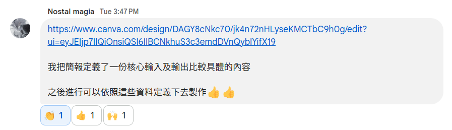

# 文件說明

## 雲服務系統架構

請參考 [ServiceStack](https://docs.google.com/drawings/d/1O6NZdSuGkCt-J88ZraJafTkZC8099ooddJuYrZyTG6E/edit?usp=drive_link)

## 專案架構

請參考 [專案簡報](https://www.canva.com/design/DAGY8cNkc70/jk4n72nHLyseKMCTbC9h0g/edit?ui=eyJEIjp7IlQiOnsiQSI6IlBCNkhuS3c3emdDVnQyblYifX19)

## 功能區塊 (以下再請各位補充)

- FE & BE
- AI
- Design
- DB / Data Sets
- Service Stack 
  - [AWS EC2](./aws_ec2.md)