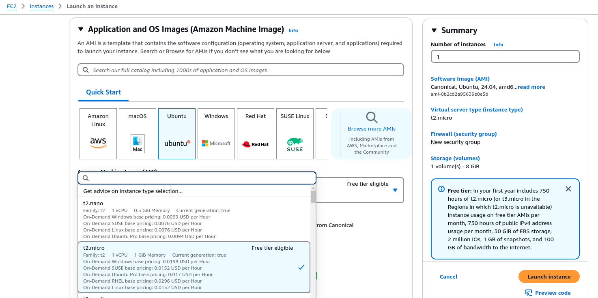
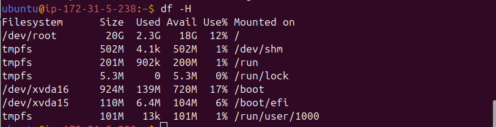

# AWS EC2

- 目前是申請一組 domain name: [__https://mystic-match.publicvm.com__](mystic-match.publicvm.com)；細節請參考 [freedomain.one](https://freedomain.one/)

- 目前已上線的 EC2 規格
  
- 目前的機器其實空間不大，我們先用，必要時需要加大加強時，我們再討論
  

- ssh 登入 EC2 的操作，需要一組 .pem，但這個 .pem 不適合上傳到 github 上來，所以有需要想測試的伙伴再請找 Neil

## 如何登入?

1. 把 .pem 檔放在 ssh client 能找到的路徑 (我的例子是放在 ~/.ssh/keys/ 下)
1. 執行下列的命令，就可以登入

```shell
$ ssh -i .ssh/keys/mystic-match.pem ubuntu@ec2-35-79-4-126.ap-northeast-1.compute.amazonaws.com

// or

$ ssh -i .ssh/keys/mystic-match.pem ubuntu@35.79.4.126

// or
$ ssh -i .ssh/keys/mystic-match.pem ubuntu@mystic-match.publicvm.com
```

__目前因為大家並不一定熟悉遠端登入及機器上的 config，且這一段只是為了把框架弄好，以方便大家實作真正與主題相關的部份，所以以上只是把文件備著，若大家真有興趣，可以再找 Neil 討論。謝謝__

## EC2 上會裝好的環境

- nvm 版號再更新上來 [連結](https://github.com/nvm-sh/nvm)
  - 用來安裝 node.js
- node.js 版號再更新上來 (以 Rein 實作時所採用的版本為主) [連結](https://nodejs.org/en)
  - FE and BE 的引擎 
- pnpm (建議採用) 版號再更新上來 [連結](https://pnpm.io/)
  - 用來協助 NUXT3 PWA 的 configuration
- uv (建議採用) 版號再更新上來 [連結](https://github.com/astral-sh/uv)
  - 用來架設 python 執行環境
- MySQL (如有需要再來裝，目前可能暫時不用，或者可以考慮改用 SQLite -- 檔案型的本地 SQL DB 引擎)